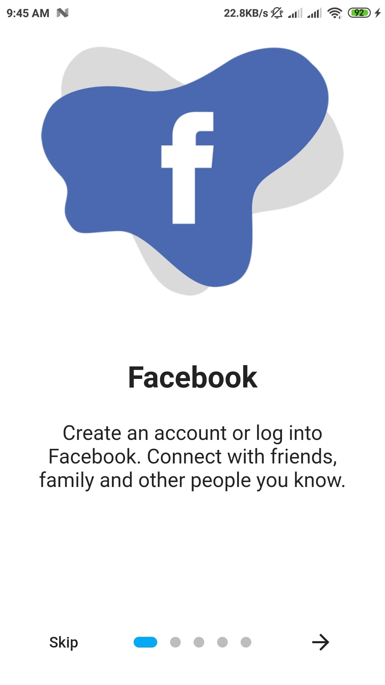
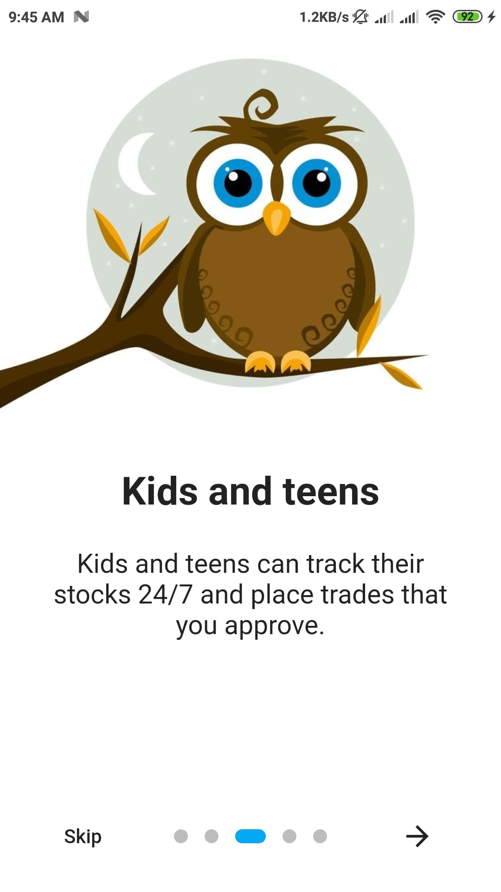
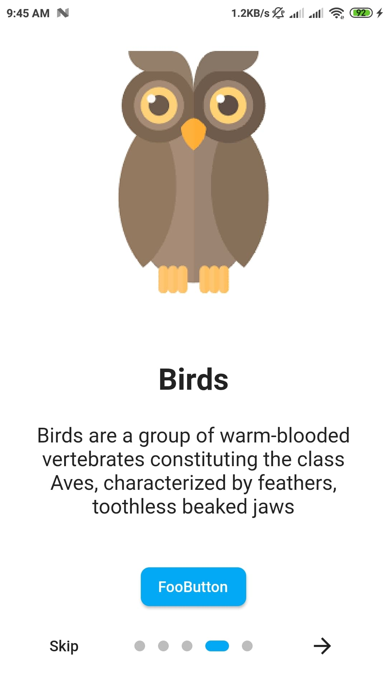
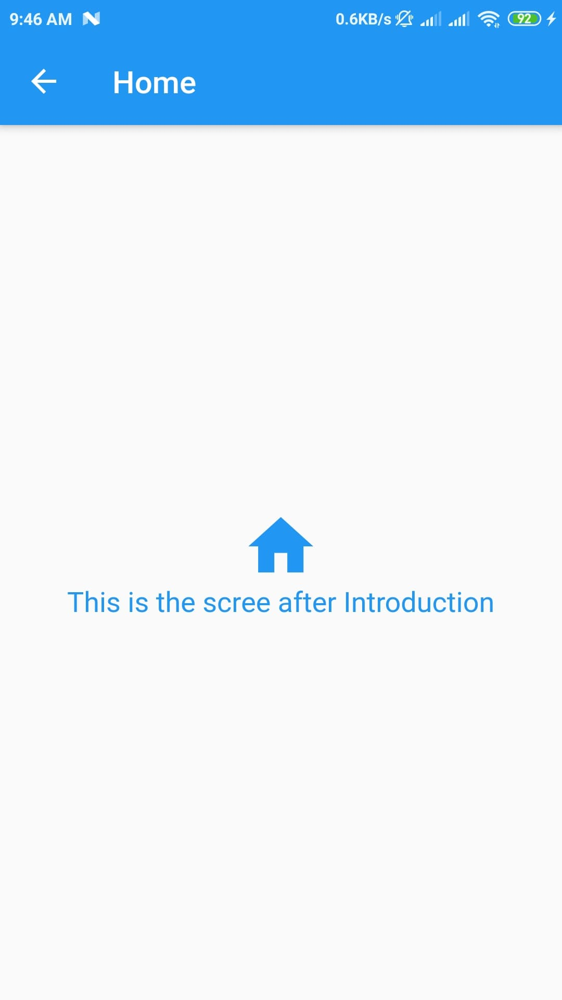

# Introduction Screen Flutter

This project is for learning how to make introduction screen in Flutter App.

### - Introduction Screen 
   
 
## Screenshots
 &nbsp;&nbsp;&nbsp;&nbsp; &nbsp;&nbsp;&nbsp;&nbsp; 
 &nbsp;&nbsp;&nbsp;&nbsp; 

